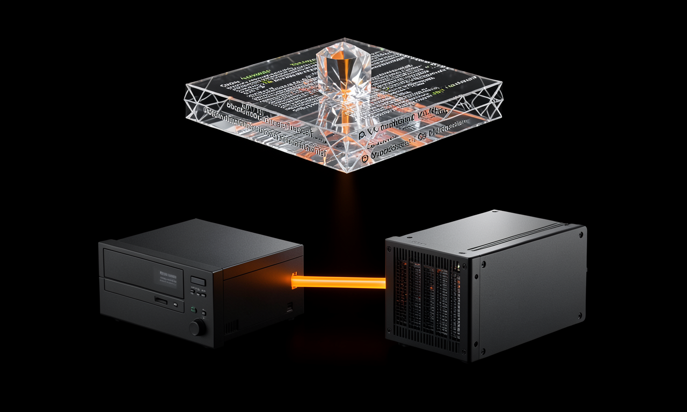
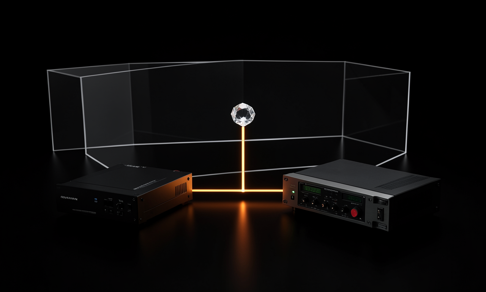
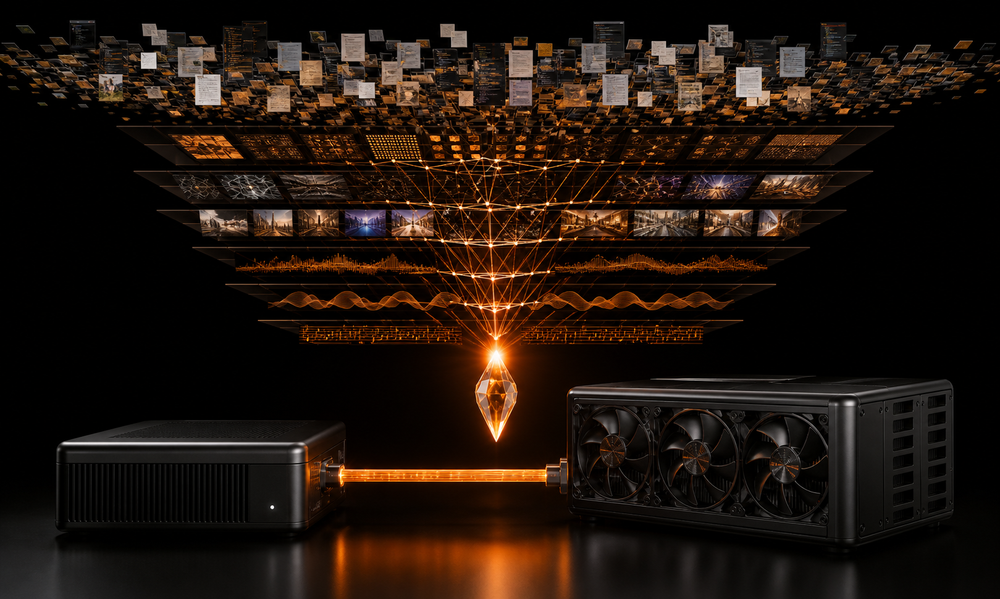

# OrangeFive FLUX.2 Versus OpenAI Same-Brief Bakeoff

**Date:** 2026-08-27  
**Purpose:** qualitative comparison and workflow falsification, not vendor ranking  
**Brief:** identical OrangeFive two-computer systems-cover concept with explicit prohibition on text, logos, people, robots, purple, decorative orbs, and cyberpunk scenery

## Images

### Local FLUX.2 Original

### Local FLUX.2 Refined Prompt

### OpenAI Same Brief

## Controlled Facts

| Property | Local FLUX.2 original | Local FLUX.2 refined | OpenAI comparison |
|---|---:|---:|---:|
| Engine | ComfyUI | ComfyUI | OpenAI image generation tool |
| Model | FLUX.2 Klein 4B FP8 | FLUX.2 Klein 4B FP8 | service-selected |
| Hardware | Codexa Intel Arc 140T XPU | Codexa Intel Arc 140T XPU | hosted |
| Resolution | 1280x768 | 1280x768 | generated landscape comparison |
| Seed | 20260827 | 20260828 | not exposed |
| Generation | 34.862 s | 36.006 s | tool call completed in about 30 s |
| Artifact hash | proven | proven | local copied artifact present |
| Local/no API | yes | yes | no |

## Human Visual Review

### OpenAI Strengths

- Best hierarchy: source archive, transformation funnel, crystal, and two devices read immediately.
- Strongest material realism and lighting coherence.
- Most complete interpretation of the system narrative.
- Cleanest use of the orange data spine.

### OpenAI Failures

- Violated the no-text constraint by rendering many document-like and interface-like regions.
- Introduced a large GPU-style compute box rather than faithfully representing the actual mini-computer topology.
- Cloud inference is not sovereign or reproducible from exposed model weights.

### Local FLUX.2 Original Strengths

- Produced a coherent two-computer product scene locally.
- Strong glass/crystal and industrial-material vocabulary.
- Clear orange physical connection.
- Fully reproducible model, workflow, seed, hardware, and artifact hashes.

### Local FLUX.2 Original Failures

- Severe pseudo-text leakage on the compression slab.
- Weak hierarchy: the slab floats separately rather than visibly compressing into the crystal.
- Less physical specificity in the devices.

### Local FLUX.2 Refined Strengths

- Removed the overwhelming document slab.
- Increased blank-space discipline and simplified the object count.
- Preserved the two-device and orange-spine requirement.

### Local FLUX.2 Refined Failures

- Pseudo-text remained on both devices despite explicit negative phrasing.
- Composition became too literal and sparse.
- The crystal and background frame do not communicate compression or layered capabilities.
- This proves prompt negation alone is not an adequate defect-removal system.

## Verdict

OpenAI wins this single composition-quality comparison. FLUX.2 wins sovereignty, reproducibility, and controllability. Neither image passed the exact no-text brief.

FLUX.2 remains OrangeFive's engine. The correct response is not replacement; it is a multi-pass FLUX.2 workflow with candidate generation, editing/multi-reference control, text-leak rejection, reward ranking, and final restoration.

## Promotion Status

- `FLUX2_RUNTIME`: **PROVEN**
- `FLUX2_ARTIFACT_INTEGRITY`: **PROVEN**
- `FLUX2_STUDIO_QUALITY`: **NOT PROVEN**
- `FLUX2_MIDJOURNEY_PARITY`: **NOT TESTED BROADLY**
- `LTX2_SEEDANCE_PARITY`: **NOT TESTED BROADLY**

No quality claim should be upgraded until the benchmark suite in `ORANGEFIVE_FLUX2_QUALITY_SYSTEM.md` passes.

